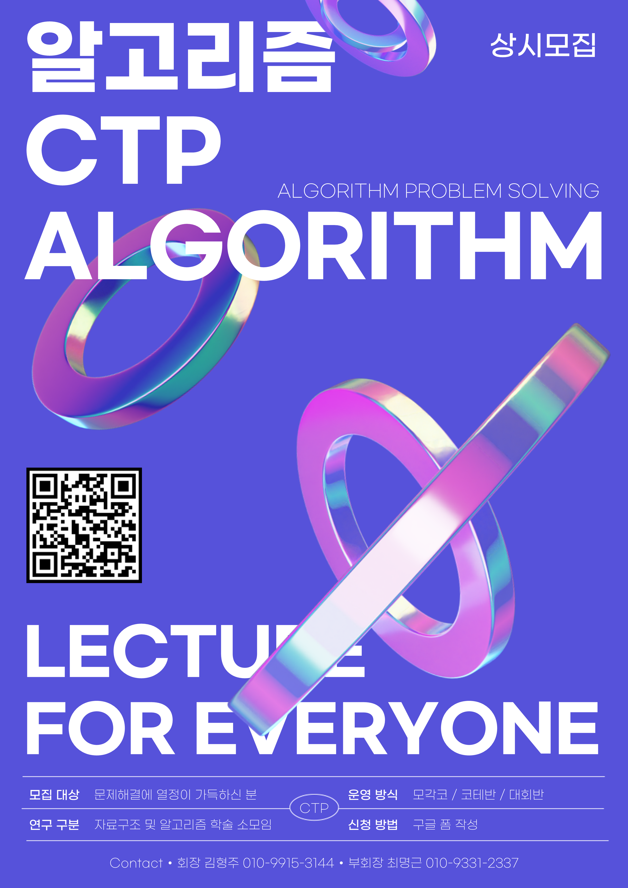

# 2025 CTP 신입 회원 을 모집합니다!

컴퓨터공학과 학술 소모임 CTP에서 신입 회원을 모집합니다!

<!-- truncate -->

CTP(Challenge The Programming)는 자료구조 및 다양한 알고리즘을 학습, 연구하거나 여러 프로그래밍 대회를 준비하는 학술 소모임입니다.  
기초적인 수학 문제부터 어려운 알고리즘이 필요한 문제까지 다양한 문제들을 풀면서 수학적 사고력과 문제 해결 능력을 기르는 것을 목표로 하고 있습니다.

## 참여 대회

- 국제 대학생 프로그래밍 경시대회 (ICPC)
- 삼성전자 대학생 프로그래밍 경진대회 (SCPC)
- 전국 대학생 프로그래밍 동아리 연합 여름 대회 (UCPC)
- 경인지역 연합 프로그래밍 경시대회 (shake!)
- 인하대학교 프로그래밍 경진대회 (IUPC)

## 역대 수상이력

- 2007 ACM-ICPC 서울대회 동상
- 2008 ACM-ICPC 서울대회 동상
- 2009 ACM-ICPC 서울대회 동상
- 2009 MS 이메진 컵 SW 설계부분 한국대회 선발전 대상
- 2010 MS 이메진 컵 차세대 웹 어워드 부문 대상
- 2012 구글 대학생 해커톤 Well-Program상
- 2015 SCPC 개인전 5위
- 2016 ACM-ICPC 은상
- 2016 SCPC 개인전 5위
- 2016 UCPC 동상
- 2018 ACM-ICPC 특별상
- 2018 shake! 3등상
- 2019 shake! 4등상
- 2020 SCPC 4등상
- 2020 shake! 3등상
- 2021 shake! 장려상(10등)
- 2022 shake! 2등상
- 2023 shake! 2등상
- 2024 shake! 5등상

이 외에도 다년간 슈퍼 챌린지 해커톤과 교내 대회 수상 이력이 있습니다.

대회 수상자는 채용 시 굉장히 유리해지고, 특히 SCPC 수상자는 학년 무관 삼성소프트웨어멤버십을 거쳐 여러 특혜를 얻습니다. 대회에서 수상하지 못하더라도 대회를 준비하며 공부한 내용은 각종 코딩테스트 대비에 큰 도움이 됩니다.

## 운영 방식

- [코테반](/docs/handbook/activities/coteban), [대회반](/docs/handbook/activities/daehwaeban)이 대면 형식으로 운영됩니다.
- [모각코](/docs/handbook/activities/mogakco)가 비대면 형식으로 운영됩니다.
- 코테반은 기업 코딩 테스트 준비를 위한 반으로, 강의 형식으로 운영될 예정입니다.
- 대회반은 교내/교외 대회 수상을 목표로 하는 사람들을 위한 반으로, 팀 단위 스터디 형식으로 운영될 예정입니다.
- 모각코는 CTP회원 누구나 참여할 수 있는 백준 랜덤 디펜스 스터디로, 주마다 랜덤 문제를 뽑아 푸는 방식으로 운영됩니다.
- 디스코드 서버를 동아리방처럼 활용해서 접근성을 높입니다.
- 코드포스, 앳코더 참여 이후 문제 풀이에 대한 의견을 나눌 수 있습니다.

## 회비 안내

이번 학기 CTP에서 활동하기 위해 납부하실 회비는 기존 회원의 경우 1만원, 신규 회원의 경우 2만원입니다.  
회비 납부 방법의 경우, 카톡 공지방에 초대해드린 이후 따로 공지가 나갈 예정입니다!

## 가입 신청

2/23부터 상시로 가입 신청이 가능합니다.
학년, 나이, 전공, 타 동아리 제한 없습니다.
문제해결에 열정만 가득하시면 됩니다 :)

신규 가입을 원하는 분께서는 아래 링크를 통해 설문에 응답해주시면 됩니다. (면접은 따로 없습니다)
이번에는 추가로 운영진 모집까지 함께 진행하고 있습니다.
https://forms.gle/GVyeMZfJp12PCjUW8

가입 신청이 확인되면 2/26, 3/1 이후 일괄적으로 카톡 공지방에 초대해 드릴 예정이며, 3/2 이후 가입 신청한 회원의 경우 설문에 응답해주신 뒤 문의해주시면 공지방에 초대해드리겠습니다.

※ 지난 학기에 이미 CTP 부원이셨던 분들은 저번 학기 공지방의 링크를 통해 설문에 응답해 주시기 바랍니다.

## FAQ

Q. 코테반과 대회반 활동 요일과 시간이 어떻게 되나요?  
A. 요일은 추후 수요조사를 통해 정할 예정입니다. 시간은 6시 이후로 예정되어 있습니다.

Q. 코테반은 어떤 언어로 진행되나요?  
A. 주로 C++로 진행됩니다.

Q. 작년 1학기에 있었던 기초반은 어떻게 된 건가요?  
A. 현재 강의 인원이 충분하지 않아, 기초반 없이 질문방만 운영하는 방식을 고려 중입니다. 이번 모집에서 강의자가 추가로 뽑힌다면 기초반을 대면 형식으로 운영할 수도 있습니다. 3월 중에 회비 환불 기간이 있으니, CTP에 가입하신 후 고민하셔도 됩니다.

## 문의

회장 김형주  
010-9915-3144

부회장 최명근  
010-9331-2337
