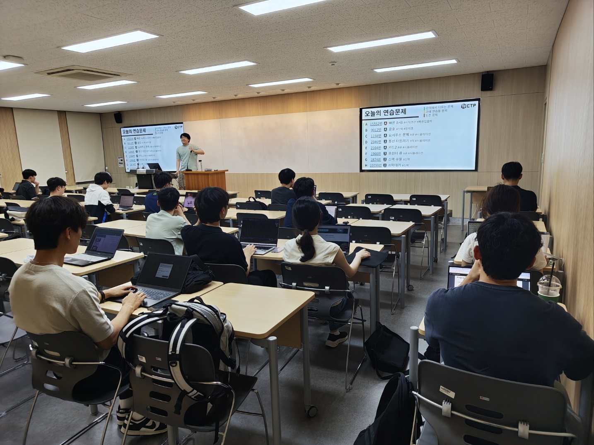

# 코테반

- 언제: 주 1회 19:00 ~ 21:00 (요일은 수요조사 후 결정)
- 어디서: 하이테크관 강의실 (강의실 번호는 매주 공지)
- 대상: 다루는 언어가 있고, 코딩테스트 준비하려는 분
- 내용: 코딩 테스트에 나오는 알고리즘과 연습 문제
- 방식: 운영진 강의 → 연습 문제 풀이
- 목표:
  - 백준 실버 문제 풀이 아이디어 바로 떠올리기
  - 골드 문제 1시간 안에 풀기

## 커리큘럼

보통 다음과 같은 커리큘럼으로 강의가 진행됩니다. 커리큘럼은 학기마다 조금씩 바뀔 수 있으니 참고만 해 주세요.

| 차시  | 내용                                 |
| ----- | ------------------------------------ |
| 1차시 | 자료구조 (스택, 큐, 덱)              |
| 2차시 | 자료구조 (우선순위 큐, 집합, 맵)     |
| 3차시 | 완전 탐색, 재귀, 백트래킹            |
| 4차시 | 정렬, 이분탐색                       |
| 5차시 | 분할정복, 투 포인터, 슬라이딩 윈도우 |
| 6차시 | 그리디                               |
| 7차시 | DP, 누적 합                          |
| 8차시 | 그래프 탐색, 트리                    |
| 9차시 | 최단 경로                            |
