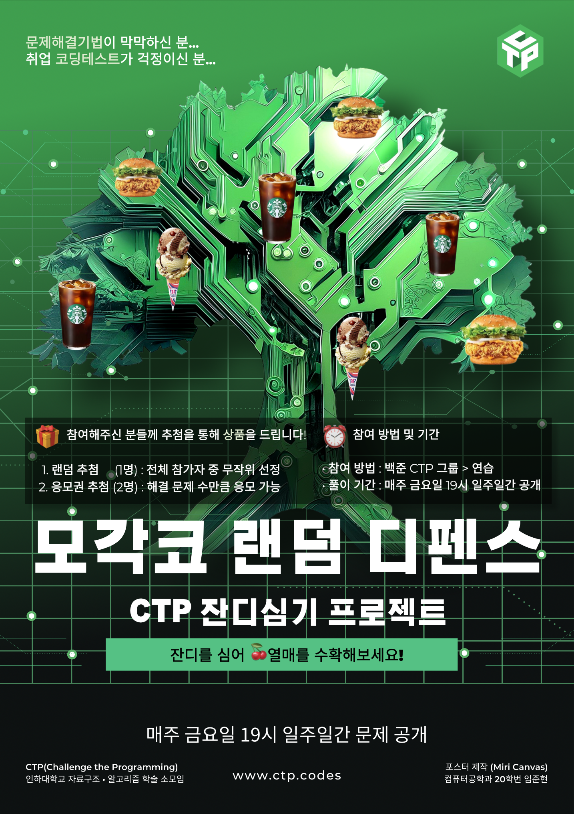

# 모각코

모각코는 CTP회원 누구나 참여할 수 있는 백준 랜덤 디펜스 스터디입니다.

- 언제: 주 1회 19:00 ~ 21:00 (요일은 수요조사 후 결정)
- 어디서: 온라인 진행
- 대상: 누구나
- 내용: 백준 랜덤 디펜스 (자율참여)

백준에 연습으로 1주일동안 다양한 난이도의 문제 4~5개정도를 올립니다.  
1주일 뒤에 문제를 푼 사람들 대상으로 상품 추첨을 합니다.  
상품은 2024년 기준 싸이버거 단품, 스타벅스 아이스 아메리카노, 배스킨라빈스 더블주니어 중 택1로 받아가실 수 있었습니다.
