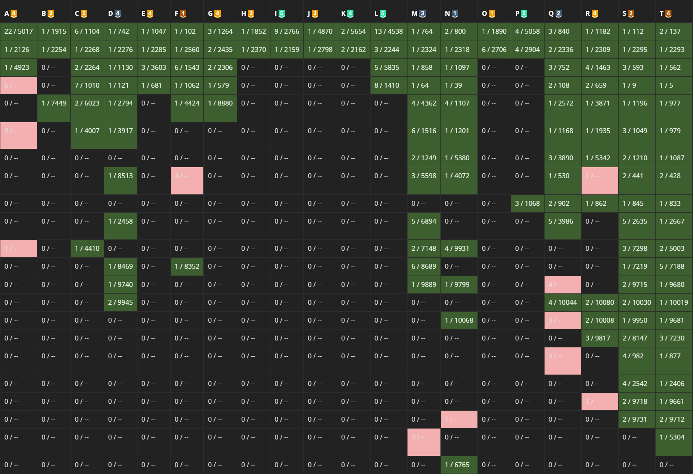

# CCC

CCC는 여름방학 시기 알고리즘 공부 독려를 위해, 참여에 부담이 되지 않도록 선정된 문제들을 1주라는 긴 기간동안 백준에서 평소처럼 공부하고 푸시면서 부원 여러분들이 상품을 받아가실 수 있도록 동아리 내부에서 준비한 작은 대회입니다.

## 참여 방법

대회 기간 내, 백준의 CTP 그룹의 '연습' 탭에서 'CCC' 에서 선정된 문제를 확인하고 백준에서 풀면 됩니다.
