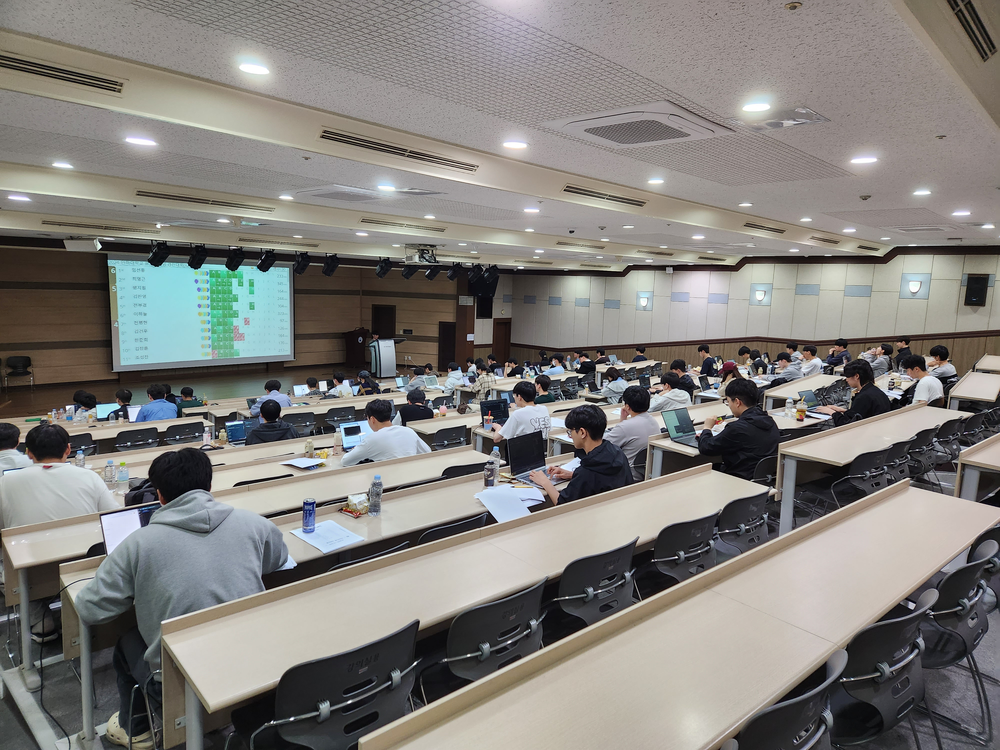

# IUPC (인하대학교 프로그래밍 경진대회)

IUPC(Inha University Programming Contest, 인하대학교 프로그래밍 경진대회)는 CTP에서 주관하는 교내 PS 대회입니다.  
2015년부터 꾸준히 진행해오고 있고, 보통 5월 중에 개최합니다.  
2022년부터는 개인전으로 진행되고 있습니다.  
상위 10명에게는 [shake!](https://shake.codes/)(경인지역 대학 연합 프로그래밍 경시대회)의 출전 자격이 주어집니다.

## 대회 목록

| 대회명    | 안내문                              | 문제목록                                                 | 대회 결과                                                  | 해설                                                                                       |
| --------- | ----------------------------------- | -------------------------------------------------------- | ---------------------------------------------------------- | ------------------------------------------------------------------------------------------ |
| 2025 IUPC |                                     | [문제목록](https://www.acmicpc.net/category/1114)        |                                                            |                                                                                            |
| 2024 IUPC | [안내문](/blog/2024/05/06/iupc2024) | [문제목록](https://www.acmicpc.net/category/1035)        | [대회 결과](htps://www.acmicpc.net/contest/spotboard/1269) | [해설](https://upload.acmicpc.net/04bcf8df-6410-4b9c-af57-6ab9c884cf36/)                   |
| 2023 IUPC |                                     | [문제목록](https://www.acmicpc.net/category/846)         | [대회 결과](https://www.acmicpc.net/contest/spotboard/988) | [해설](https://u.acmicpc.net/84be71cc-e646-4d69-8b9b-5e917667f0de/2023_IUPC_editorial.pdf) |
| 2022 IUPC |                                     | [문제목록](https://www.acmicpc.net/category/detail/3124) | [대회 결과](https://www.acmicpc.net/contest/spotboard/779) | [해설](https://u.acmicpc.net/004284b6-04d9-4924-af60-204fad7cc864/2022_IUPC_editorial.pdf) |
| 2021 IUPC |                                     | [문제목록](https://www.acmicpc.net/category/detail/2803) | [대회 결과](https://www.acmicpc.net/contest/spotboard/706) |                                                                                            |
| 2020 IUPC |                                     | [문제목록](https://www.acmicpc.net/category/detail/2381) | [대회 결과](https://www.acmicpc.net/contest/spotboard/579) |                                                                                            |
| 2019 IUPC |                                     | [문제목록](https://www.acmicpc.net/category/detail/2037) | [대회 결과](https://www.acmicpc.net/contest/spotboard/425) |                                                                                            |
| 2018 IUPC |                                     | [문제목록](https://www.acmicpc.net/category/detail/1876) | [대회 결과](https://www.acmicpc.net/contest/board/300)     |                                                                                            |
| 2017 IUPC |                                     | [문제목록](https://www.acmicpc.net/category/detail/1745) | [대회 결과](https://www.acmicpc.net/contest/spotboard/240) |                                                                                            |
| 2016 IUPC |                                     | [문제목록](https://www.acmicpc.net/category/detail/1492) | [대회 결과](https://www.acmicpc.net/contest/spotboard/168) |                                                                                            |
| 2015 IUPC |                                     | [문제목록](https://www.acmicpc.net/category/detail/1422) | [대회 결과](https://www.acmicpc.net/contest/spotboard/145) |                                                                                            |

<!-- IUPC 역대 대회 목록들만 여기 적어놓고, 대회 안내문이나 결과 등 자세한 정보들은 pages 안에 개별 문서로 작성해도 좋을듯? 그런데 그러면 개별 문서에 적을 내용 자체가 그리 많지 않아서 안 좋은 것 같기도 함 -->
